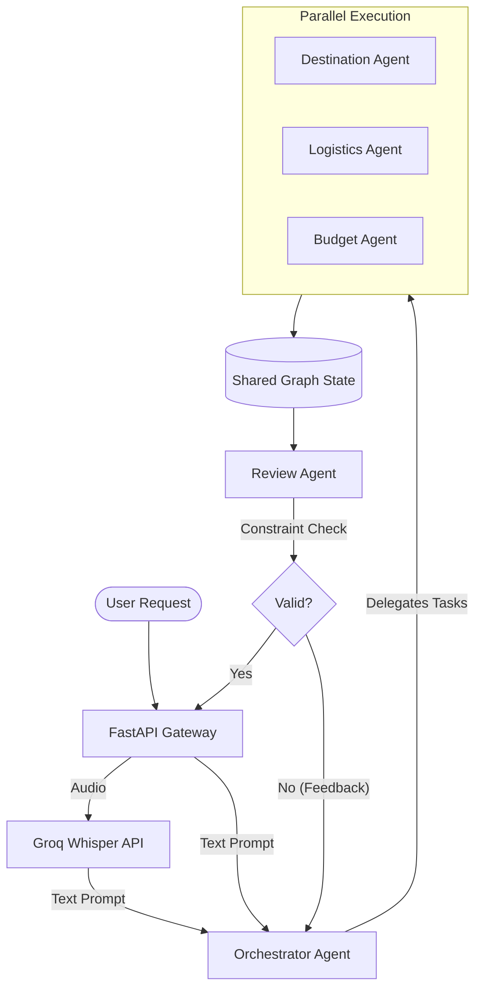

# Architecture Design: AI Travel Planner (Dubai)

## 1. System Overview
The system is built on a **Multi-Agent Architecture** where specialized AI agents collaborate to generate a comprehensive, personalized travel itinerary. The system utilizes an orchestrator-worker pattern combined with a review loop to ensure the final output respects the user's constraints (e.g., budget, time, preferences).

## 2. Technology Stack
- **Multi-Agent Framework:** [LangGraph](https://python.langchain.com/v0.1/docs/langgraph/) or [AutoGen](https://microsoft.github.io/autogen/) (ideal for cyclic graphs and agent communication).
- **LLM Engine:** OpenAI GPT-4o, Anthropic Claude 3.5 Sonnet, or Google Gemini 1.5 Pro.
- **Speech-to-Text:** Groq Whisper (`whisper-large-v3`) for audio transcription.
- **Backend/API:** Python with FastAPI.
- **State Management:** In-memory graph state (LangGraph) or Redis for persistence.

## 3. High-Level Architecture Diagram


## 4. Agent Specifications

### 4.1 Orchestrator Agent
- **Role:** The system manager. Parses the initial request and delegates work.
- **Input:** Natural language string (e.g., *"Plan a 5-day trip to Dubai. $3,000 budget..."*).
- **Output:** Structured JSON containing extracted constraints (`Destination`, `Duration`, `Budget`, `Preferences`, `Avoidances`).

### 4.2 Destination Research Agent
- **Role:** The local Dubai domain expert.
- **Tools/Integrations:** Google Places API, Tavily Search (for real-time web search), Tripadvisor API.
- **Output:** A curated list of architectural landmarks (e.g., Museum of the Future, Burj Khalifa), authentic food districts, and experiences, prioritizing less crowded options.

### 4.3 Logistics Agent
- **Role:** The routing and accommodation expert.
- **Tools/Integrations:** Google Maps Routes API (for Dubai Metro and taxi estimates), Amadeus API (for hotels).
- **Output:** Neighborhood recommendations (e.g., Downtown Dubai vs. Dubai Marina), optimal daily routing to minimize travel time, and transit suggestions.

### 4.4 Budget Agent
- **Role:** The financial planner.
- **Tools/Integrations:** ExchangeRate-API (AED to USD), historical pricing data.
- **Output:** Cost breakdowns across categories (Stay, Transport, Food, Activities) and alerts if the compiled plan exceeds the $3,000 limit.

### 4.5 Review Agent
- **Role:** Quality Assurance (QA).
- **Input:** The compiled `ItineraryProposal` and the original `TravelConstraints`.
- **Output:** A strict Pass/Fail assessment. If it fails, it generates targeted feedback (e.g., *"The hotel in Downtown Dubai pushes the budget to $3,200. Ask the Logistics Agent to find a cheaper area."*) to trigger a retry loop.

## 5. Data Flow & Execution Graph
1. **Transcription (Optional):** If the user provides audio, it is routed to the Groq `whisper-large-v3` model and transcribed into text.
2. **Extraction:** The user's text (or transcribed audio) is parsed into a structured state object (`TravelState`).
3. **Delegation:** The Orchestrator triggers the Destination, Logistics, and Budget agents simultaneously.
3. **Execution:** Each agent performs API calls and LLM reasoning, appending their findings to `TravelState`.
4. **Synthesis:** The Orchestrator compiles the individual findings into a cohesive day-by-day itinerary.
5. **Validation Loop:** The Review Agent assesses the itinerary. 
   - If **Approved**: The final itinerary is returned to the user.
   - If **Rejected**: The graph loops back to the Orchestrator with the Review Agent's feedback. (Limited to max 3 iterations to prevent infinite loops).

## 6. Core Data Models

### UserConstraints Schema
```json
{
  "destination": "Dubai",
  "duration_days": 5,
  "budget_usd": 3000,
  "preferences": ["food", "modern architecture"],
  "avoidances": ["crowds"]
}
```

### Itinerary Output Schema
```json
{
  "total_estimated_cost": 2850,
  "accommodation": {
    "neighborhood": "Dubai Marina",
    "rationale": "Great architecture, easy metro access, fits budget."
  },
  "daily_plan": [
    {
      "day": 1,
      "theme": "Modern Marvels",
      "activities": [...],
      "transit_notes": "Take Metro Red Line"
    }
  ]
}
```
